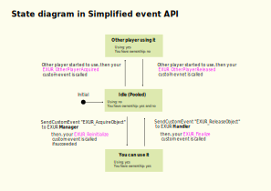
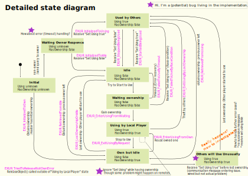
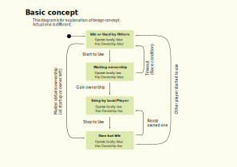

# EXUR (EXclusive Use and Reusing objects) Manual

<!-- TOC depthfrom:2 depthto:3 orderedlist:false insertanchor:false -->

- [Elements](#elements)
    - [Basic structure](#basic-structure)
    - [EXUR Manager](#exur-manager)
    - [EXUR Handler](#exur-handler)
    - [User Program](#user-program)
- [API](#api)
    - [Manager Methods and Properties](#manager-methods-and-properties)
    - [Handler Methods and Properties](#handler-methods-and-properties)
    - [Handler simplified event API](#handler-simplified-event-api)
    - [Handler detailed event API](#handler-detailed-event-api)
    - [Manager event API](#manager-event-api)
    - [ManagerFailure details](#managerfailure-details)
- [Feature details](#feature-details)
    - [Tag feature](#tag-feature)
- [Internal design note](#internal-design-note)

<!-- /TOC -->

## Elements

### Basic structure

* You can add child GameObjects to Pooled GameObject.
* You can add other components to this structure.

### EXUR Manager
EXUR Manager manages pooled game objects.
It gathers child objects and treats as pooled objects.
To operate the pool User program calls EXUR Manager custom event (or as a method in U#).

### EXUR Handler
EXUR Handler operates one pooled object.
Target pooled object is a GameObject where the EXUR Handler is attached.
To operate each pooled object User program calls EXUR Handler custom event.

UdonBehaviour that hosts EXUR Handler must be the first UdonBehaviour component in the pooled GameObject.

### User Program
Library user prepares UserProgram if needed.

EXUR expects that has certain custom events and program variables.
Their name and type are defined by EXUR.
So you can make UserProgram with UdonGraph and UdonSharp.

These custom events and variables are optional.
You only need to implement what you need because it is just ignored if it doesn't exist.
You just implement you want to know the event happened.

UdonBehaviour components placed in Pooled GameObject are treated as User Program.
Also UdonBehaviours attached to children GameObject can be User Program.
(see `IncludeChildrenToSendEvent` option)

## API

### Manager Methods and Properties

This section explains `Iwsd.EXUR.Manager` methods (custom events) and properties (program variables).

#### `AcquireObject()`

Request to acquire one object from the pool.

#### `AcquireObjectWithTag(string tag)`

Argument program variable: `string AcquireObjectWithTag_tag`

Request to acquire one object that has specified tag from the pool.
If no object has specified tag, Manager assigns the tag to free object (if available) and passes it to User Program.

To use this method, pooled GameObject must be properly setup. See [Tag feature](#tag-feature) for details.

#### `AcquireObjectForEachPlayer()`

Request to acquire one object for each player.

It uses Player `displayName` as a tag to select object.

#### `UdonBehaviour EventListener`

UdonBehaviour that is called when Manager event happens.

If you need to know what happens on the pool, set your UdonBehaviour to this properly.
See [Manager event API](#manager-event-api) for details.

#### `int TotalCount`

Total number of pooled objects.
Intend to be readonly.

#### `int FreeCount`

Number of free pooled objects.
Intend to be readonly.

#### `UnityEngine.UI.Text DebugText`

Text component for viewing internal log.
This is for debug purpose and might be removed in future release.
    

### Handler Methods and Properties

This section explains `Iwsd.EXUR.Handler` methods (custom events) and properties.

#### `Iwsd.EXUR.Handler.ReleaseObject()`

#### `bool IncludeChildrenToSendEvent`

If true, Handler call SendCustomEvent of UdonBehaviours that are attached on children GameObjects.
(To be exact "children" means "descendant" like `GetComponentsInChildren()`)

Set with Unity inspector. Changing value at runtime is not valid.

#### `bool DeactivateWhenIdle`

If true, pooled object is deactivated when it becomes idle.

Set with Unity inspector. Changing value at runtime is not valid.

#### `UnityEngine.UI.Text DebugText`

Text component for viewing internal log.
This is for debug purpose and might be removed in future release.

### Handler simplified event API

User Programs that placed on each pooled GameObject can react for these events if you implement these custom event.

| Category       | Custom-Event Name        | Meaning                                        |
|----------------|--------------------------|------------------------------------------------|
| Simplified API |                          |                                                |
|                | EXUR_Reinitialize        | Called when you can use the object             |
|                | EXUR_Finalize            | Called when you should end to use and clean up |
|                | EXUR_OtherPlayerAcquired | Called when other player started to use        |
|                | EXUR_OtherPlayerReleased | Called when other player stopped to use        |

NOTE: `EXUR_OtherPlayerAcquired` is also happens when joining if the object is currently used by other player.

### Handler detailed event API

If you want to know more detailed state transition, use these custom event.

You can use simplified and detailed events together.
(actually simplified events are "combined" aliases.)

For U# users: You can use `EXURHandlerListener.cs` as a template of your implementation.

| Category                   | Custom-Event Name               | Comment                                                 | Simplified to |
|----------------------------|---------------------------------|---------------------------------------------------------|---------------|
| Result of initialization   |                                 | Spontaneous transition after Start                      |               |
|                            | EXUR_InitializedToOwn           |                                                         |               |
|                            | EXUR_InitializedToIdle          |                                                         |               |
|                            | EXUR_InitializedToUsing         | Don't confuse this "Using" with "Using by local player" | 3             |
| Transition while not owned |                                 | Another players start and stop using                    |               |
|                            | EXUR_StartedBeingUsed           |                                                         | 3             |
|                            | EXUR_StoppedBeingUsed           |                                                         | 4             |
| Result of start request    |                                 | Happens after acquire request                           |               |
|                            | EXUR_FailedToUseByTimeout       |                                                         |               |
|                            | EXUR_FailedToUseByRaceCondition |                                                         | 3             |
|                            | EXUR_EnterUsingFromWaiting      |                                                         | 1             |
|                            | EXUR_EnterUsingFromOwn          |                                                         | 1             |
| Result of stop request     |                                 | Happens after release request                           |               |
|                            | EXUR_ExitUsingByRequest         |                                                         | 2             |
|                            | EXUR_TriedToReleaseNotOwnError  | Happens if the object is not in appropriate state       |               |
| Losing ownership           |                                 |                                                         |               |
|                            | EXUR_ExitUsingByLostOwnership   | Happens while using                                     | 2 and 3       |
|                            | EXUR_LostOwnershipOnIdle        | Happens while idle                                      |               |
| Retrieve by Master         |                                 | (EXUR_InitializedToOwn is not categorized here)         |               |
|                            | EXUR_RetrievedFromUsing         |                                                         |               |
|                            | EXUR_RetrievedFromIdle          |                                                         |               |

Simplified column value

| in above table | translate to             |
|---------------:|--------------------------|
|              1 | EXUR_Reinitialize        |
|              2 | EXUR_Finalize            |
|              3 | EXUR_OtherPlayerAcquired |
|              4 | EXUR_OtherPlayerReleased |

NOTE:
This state diagram is not from system-wide view.
It is from the point of view of a player (or "of a client").
Let us suppose that there's one object and two players X and Y are joining the world.
In VRChat, networked object is always owned by someone.
If X has ownership, the state of the object is "Own but Idle" from the point of view of player X.
At same time, it is "Idle" for player Y.

### Manager event API

Listener interface:

        [HideInInspector] public UdonBehaviour EXUR_EventSource;
        [HideInInspector] public string EXUR_EventName;
        [HideInInspector] public string EXUR_EventAdditionalInfo;
        public void EXUR_ReceiveEvent()
        {
            // your code
        }

Set this listener UdonBehaviour to `Iwsd.EXUR.Manager.EventListener`

For U# users: You can use `EXURManagerListener.cs` as a template of your implementation.

(TODO: Describe above definition more "politely". Make it friendly also for UdonGraph users.)
(TODO: explain more about aggregation of Handler events.)

| EXUR_EventSource | EXUR_EventName            | EXUR_EventAdditionalInfo   | Comment                               |
|------------------|---------------------------|----------------------------|---------------------------------------|
| EXUR.Handler     | (see "Handler event API") | -                          | Aggregate and propagate Handler event |
| -                | InUseBySelf               | -                          | Already in use by myself              |
| -                | InUseByOthers             | -                          | Already in use by others              |
| -                | NoFreeObject              | -                          | No more free object                   |
| -                | ManagerFailure            | human readable description | program error etc.                    |

"-" means don't care. Actually it is null.

### ManagerFailure details

This is internal specification so it will be changed.

| Description header | Possible case                                |
|--------------------|----------------------------------------------|
| InternalError:     |                                              |
|                    | Multiple objects have identical tag          |
|                    | localTagBuffer is not clear though it's free |
| UserProgramError:  |                                              |
|                    | Specified tag is null                        |
|                    | Specified tag is empty                       |
|                    | No sibling UdonBehaviour (for Tag)           |
|                    | Does not have EXUR_Tag variable variable     |
|                    | Does not have EXUR_LastUsedTime variable     |

## Feature details

(Draft. TODO create sections and refine.)

* ownership
    * Ownership is controlled on "Pooled GameObject"
    * Ownership of child object(s) is not controlled by EXUR
    * Delay for safer sync variable writing
    * handler will be pass to user program by manager event after ownership obtained.
    * Do not call `Networking.SetOwner` on "Pooled GameObject" if you don't understand what will happen.
* additional note for features
    * synced variable free
        * to avoid network load
* Assignment algorithm described
    * try to use owned object first for speed
        * So previous user continues to holds ownership of released object until other client requires.
    * random index to avoid race condition
    * Least recently used (LRU) algorithm for tag

### Tag feature

(Draft. TODO Refine me.)

* tag is a string
* tag is used to identify object. It's like temporarily name.
* string.Empty means "not used". it can not be used usual value. (null is also)
* First sibling UdonBehavior must have certain variables
    * First sibling (second in the GameObject) UdonBehaviour must have program variables:
        * `[UdonSynced] string EXUR_Tag`
        * `[UdonSynced] int EXUR_LastUsedTime`
* EXUR library try to preserve and use identical object if possible
* If no room for new acquired object, old object will be purge with Least recently used (LRU) algorithm
    * User can update EXUR_LastUsedTime. (Of course it should be done on owner client.)
* interface note: how to passing argument

## Internal design note

**Tag needs to be synced variable**

* so it implemented on another UdonBehavior.
* to let core (Handler) be synced variable free.
* Before obtaining ownership, it can not use synced variable. So it stores to local buffer.
It's uneasy(?) problem where to hold the local buffer.
It is possible to store it to user (sibling) Udon Program.
But we choose Handler because we want to be "clean" user program as much as possible.

**method name prefix policy**

* (i.e. custom event name)
* to avoid conflict on user program.

**original concept**

